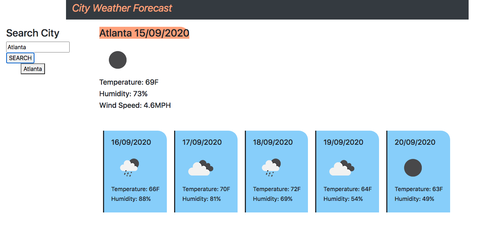

# dynamic-weather-dashboard

## Objective 
Create a dynamic weather dashboard that shows the users current day weather and a 5 day forecast. The application will run the users' input through an api call and pull the related data into the dashboard.

## Usage 
Users will be able to search a city by title and then see the temperature, humidity and wind speed values for the corresponding city.

## Screenshot

## Reference

Pulling API information from:

- [OpenWeather](https://https://openweathermap.org/)

